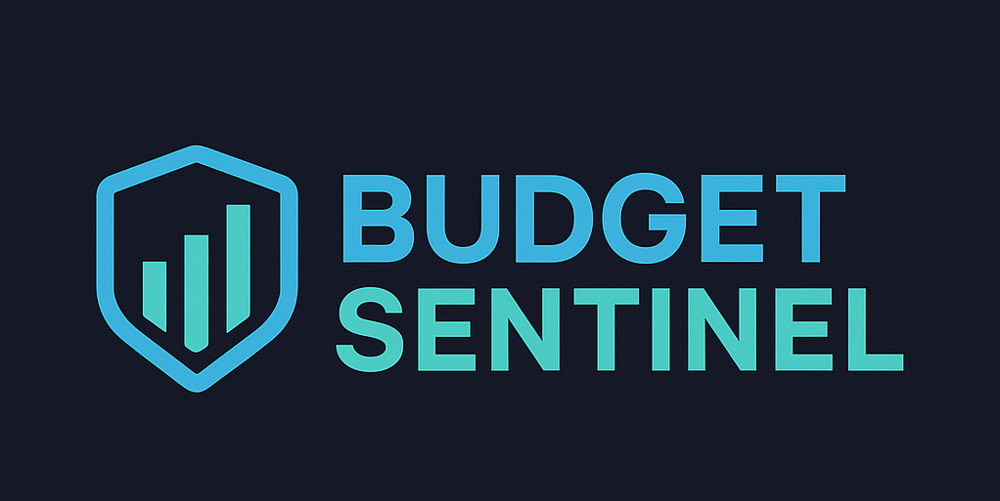
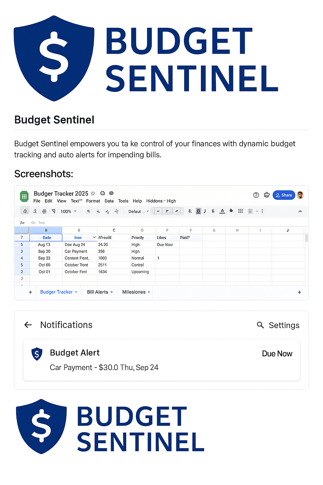

<p align="center">
  
</p>

<h1 align="center">Budget Sentinel</h1>
<p align="center"><em>Your automated Google Sheets + Calendar + Alerts system for managing monthly budgets</em></p>

<p align="center">
  
  
  
  
</p>

---

## 🧩 Overview

**Budget Sentinel** empowers you to take control of your finances with dynamic budget tracking, Google Calendar integration, and real-time notifications via [ntfy.sh](https://ntfy.sh).

Perfect for:
- Individuals and families
- Freelancers
- Small businesses
- Personal finance hackers

---

## 📸 Screenshots


<br/>


---

## ✨ Features

- 📅 Auto-syncs Google Sheets due dates to Google Calendar
- 🔔 Sends real-time budget alerts via ntfy
- 💵 Monthly income and payment tracking
- 📊 Dashboard with remaining balance and milestone insights
- ☁️ Lightweight, no install — just Google Sheets + Apps Script
- 🔁 Fully customizable and extendable

---

## 📂 Folder Structure

```
budget-sentinel/
├── assets/
│   ├── budget-sentinel-logo.png
│   ├── screenshot-tracker-preview.png
│   └── screenshot-alert-preview.png
├── scripts/
│   └── setup.sh
├── src/
│   └── budget_alerts.gs
├── .gitignore
├── LICENSE
└── README.md
```

---

## ⚙️ How to Use

1. **Import `budget_alerts.gs` into Apps Script**
   - Create a new Apps Script project in Google Sheets
   - Paste the content of `src/budget_alerts.gs`

2. **Link your sheet**
   - Sheet tab must be named `Budget Tracker`
   - Required columns: `Date`, `Item`, `Amount`, `Paid?`, `Status`

3. **Set up time-based trigger**
   - Run `createBudgetReminders`
   - Add time-based trigger to run daily

4. **Set up `ntfy`**
   - Use a topic like `budget` (e.g., `https://ntfy.sh/budget`)
   - Optional: Subscribe via ntfy app, browser, or CLI

---

## 📜 License

This project is licensed under the MIT License. See the [LICENSE](LICENSE) file for details.

---

## 🤝 Contributing

Pull requests are welcome! Feel free to fork and improve — just submit a PR when ready.

---

## 💡 Future Ideas

- 📈 Spend analytics
- 📥 Email digest of upcoming bills
- 🧠 AI budget suggestions
- 🛠️ GUI add-on for easier use

---

**Made with ❤️ by [@gusinfosec](https://github.com/gusinfosec)**